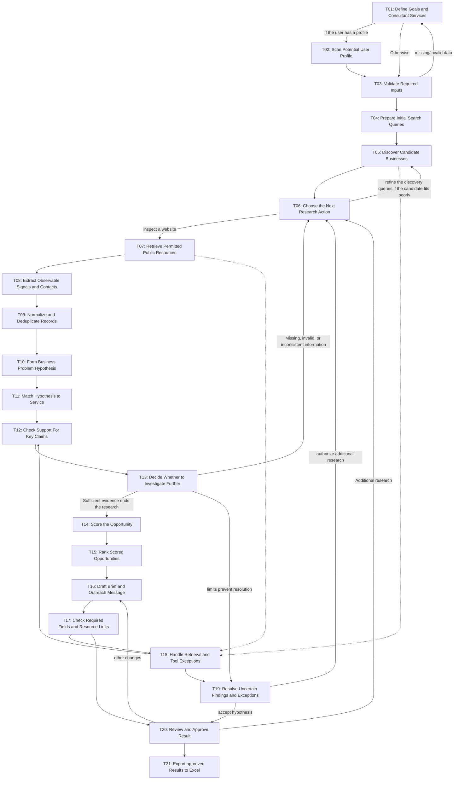

# Workflow of Tasks

*BUS 4498 Team Build Milestone 1. Save this file at `our_team_agent/agent/workflow-of-tasks.md` in `BUS4498_Team_Build`. Complete the prompts for your team's own problem. Remove these instructions and unused prompts before submitting.*

## 1. Workflow Goal

This workflow supports the goal in our completed (https://github.com/aJorge2002/BUS4498_Team_Build/blob/main/README.md)

"Using the goals of a business, the agent will discover prospecting clients, collect evidence, identify the needs of the business, and generate intelligence briefs. Everything the agent finds will be backed up with sources. System aims to reduce the time required for research. System will also scrape contact information and create basic excel sheet with information on potential clients."

## 2. Workflow Trigger

User inputs industry, location, services, and research limits. This is used to specify the target audience and business goals. If the user has created a profile, the agent will scan through the user’s data in T02. Otherwise, the agent jumps to T03.

## 3. Completion Condition at Runtime

Analysis results are moved to excel for potential presentations.

## 4. General Workflow

### T01: Define Goals and Consultant Services

User inputs industry, location, services, and research limits. This is used to specify the target audience and business goals. If the user has created a profile, the agent will scan through the user’s data in T02. Otherwise, the agent jumps to T03.

### T02: Scan Potential User Profile

If the user has a profile, AI will evaluate it. This information may include criteria such as the user’s resume, experience, and preferred industries, GitHub, LinkedIn, school affiliation, and portfolio.

### T03: Validate Required Inputs

Validates input and checks for missing/invalid data.

### T04: Prepare Initial Search Queries

Business goals are translated into relevant queries. Does not choose later actions.

### T05: Discover Candidate Businesses

Execute supplied queries with correct industry and location filters. Returns businesses and sources.

### T06: Choose the Next Research Action

Findings guide what action is permitted to occur next. Can investigate an expansion signal, inspect a website, or refine the discovery queries if the candidate fits poorly.

### T07: Retrieve Permitted Public Resources

Tools fetch websites, service pages, landing pages, reviews, listings, and job postings. Anything publicly available.

### T08: Extract Observable Signals and Contacts

AI extracts memberships, models, locations, expansion plans, service complaints, scheduling complaints, and outdated forms. Marks missing information. Sources are also outputted.

### T09: Normalize and Deduplicate Records

Duplicates are merged while ensuring sources are not lost

### T10: Form Business Problem Hypothesis

AI interprets collected information and creates a list of client problems. This list will be saved as a separate PDF.

### T11: Match Hypothesis to Service

AI analyzes past inputs to match a potential business problem correctly within the user’s scope of expertise.

### T12: Check Support For Key Claims

AI compares claims with missing, invalid, or inconsistent information. This step’s collected information is saved for the next research decision.

### T13: Decide Whether to Investigate Further

Missing, invalid, or inconsistent information triggers selection for a query. Sufficient evidence ends the research. Exhausted

### T14: Score the Opportunity

AI creates a weighted score model based on likely need, potential value, connection potential, contact ease, and consultant fit

### T15: Rank Scored Opportunities

Rank opportunities using a predefined weighted formula that was calculated by platform beforehand (reference README)

### T16: Draft Brief and Outreach Message

Agent creates one page brief with all information collected. Information on draft consists of a summary, potential value, connections, contact ease, hypothesis, project scope, potential shareholders, potential sponsors, and potential connections.

### T17: Check Required Fields and Resource Links

Verify structure and evidence. Using information from T11.

### T18: Handle Retrieval and Tool Exceptions

Review if all information is significant enough for potential. If too manyissues arrise, return to T12 or move to T18.

### T19: Resolve Uncertain Findings and Exceptions

User decides whether to accept hypothesis, reject an opportunity, or authorize additional research when limits prevent resolution

### T20: Review and Approve Result

Human checkers results. Additional research and other changes must require user approval.

### T21: Export approved Results to Excel

Analysis results are moved to excel for potential presentations.

## 5. Workflow Diagram

# Workflow of Tasks

